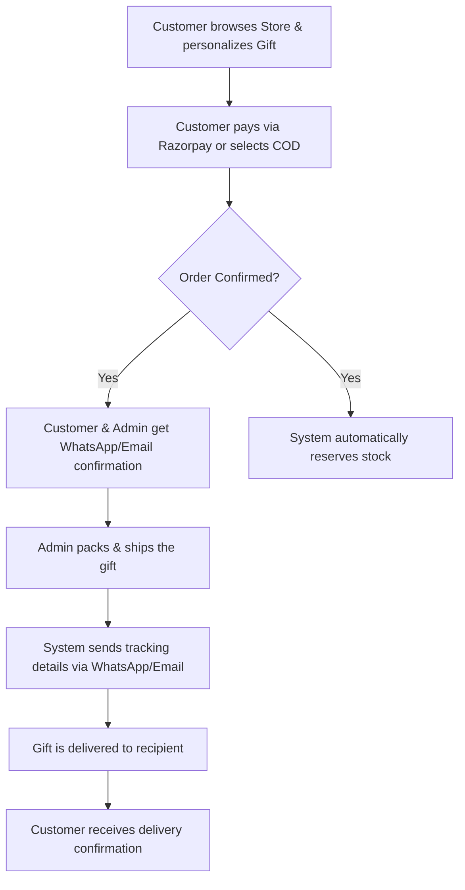

# Symphony Gifting Platform: Business Overview

Symphony is a premium, modern e-commerce platform specifically built to capture the high-growth **retail (B2C)** and **corporate (B2B) gifting markets**. Designed to deliver an editorial luxury shopping experience, Symphony moves away from transactional commodity retail, focusing instead on emotional commerce, product personalization, and relationship-driven B2B sales.

---

## 💎 The Symphony Value Proposition

For a business owner, Symphony represents three core opportunities:

1. **Brand Distinction through Premium Experience:** Symphony uses a warm, editorial design (ivory, charcoal, and gold brand accents) and smooth interactions to position your brand as a high-end gifting destination.
2. **Dual-Revenue Engine (B2C & B2B):** The platform serves two distinct business lines seamlessly: individual buyers sending single gifts, and corporate entities ordering hampers in bulk.
3. **Operational Autonomy:** With a centralized Admin Control Center, non-technical team members can manage the product catalog, process orders, run discount campaigns, write blog posts, and manage banners without requiring active support from developers.

---

## 🛍️ Who Does Symphony Serve?

* **B2C Gifting Customers:** Shoppers looking for high-quality, memorable, and personalized gifts (such as cushions, flowers, custom jewelry, and cakes) for specific personal occasions like birthdays, anniversaries, or festivals.
* **B2B / Corporate Clients:** Companies requiring custom branding, bulk client hampers, promotional items, or seasonal corporate gifts with personalized inquiries and custom quotes.
* **Internal Operations Team:**
  * **Store Managers:** Overseeing inventory, editing prices, processing orders, and checking revenue metrics.
  * **Content Editors:** Publishing blogs, updating banners, and highlighting testimonials.
  * **Sales Representatives:** Managing incoming corporate inquiries and converting them to bulk sales.

---

## 📋 Comprehensive Service Catalog

Symphony organizes its capabilities into specialized business services. Below is a breakdown of what each service does and the value it brings to your business operations.

### 1. Storefront & Gift Discovery Service
* **What it does:** Provides the digital window for your brand. It organizes products not just by standard categories, but by **occasions** (e.g., Birthdays, Anniversaries, Corporate Events) and **curated collections** (e.g., Gift Hampers).
* **Business Value:** Gift buyers are highly occasion-driven. By structuring discovery around events, you match the user's intent immediately, reducing search fatigue and increasing conversion rates.

### 2. Product Personalization & Customization Service
* **What it does:** Allows customers to customize their selections (e.g., adding text, uploading photos for caricatures or frames), choose premium gift wrapping, and attach written cards.
* **Business Value:** Personalization shifts your products from standard commodities to high-margin emotional keepsakes, justifying premium price points and driving customer satisfaction.

### 3. Corporate Gifting & B2B Lead Service
* **What it does:** Provides a dedicated portal for businesses seeking bulk gifts. It allows corporate clients to browse catalog options and submit detailed inquiry forms outlining budget, quantity, and customization needs.
* **Business Value:** Unlocks high-volume bulk transactions. By giving corporate leads a direct, structured path to contact your sales team, you capture valuable enterprise orders and establish long-term relationship clients.

### 4. Frictionless Checkout & Multi-Payment Service
* **What it does:** Integrates with India's leading payment gateway (Razorpay) to accept UPI (Google Pay, PhonePe, Paytm), credit/debit cards, Net Banking, and digital wallets, alongside Cash on Delivery (COD) options.
* **Business Value:** Payment drop-offs are a leading cause of abandoned carts. By offering every popular Indian payment method in a fast, mobile-friendly checkout layout, you secure maximum completed sales.

### 5. Automated Customer Communication Service (WhatsApp & Email)
* **What it does:** Sends automated, real-time message updates directly to customers via **WhatsApp** and **Email** at key moments: order confirmation, shipping tracking details, and successful delivery alerts.
* **Business Value:** Keeps your customers informed without operational overhead. Providing shipping tracking immediately cuts down on "Where is my order?" support calls, while WhatsApp notifications achieve near 100% open rates, driving customer trust.

### 6. Admin Alerting & VIP Customer Service
* **What it does:** Notifies store administrators via WhatsApp immediately when a new order is placed, specifically flagging unusually large or high-value VIP orders.
* **Business Value:** Allows your operations team to prioritize high-value shipments, ensuring premium service for your most important clients and enabling rapid response times.

### 7. Customer Loyalty & Self-Service Portal
* **What it does:** Gives registered customers an account dashboard to view their order history, manage a multi-address book (ideal for sending gifts to different friends and family members), track deliveries, and save items to a wishlist.
* **Business Value:** Boosts customer retention and repeat purchase rates by making it simple for customers to log back in, choose an address they used last year, and re-order.

### 8. Promotion & Campaign Management Service
* **What it does:** Empowers you to create, schedule, and track promotional coupon codes (either percentage-based or fixed-value discounts) with custom validation rules (like minimum order values or expiration dates).
* **Business Value:** Drives sales during key retail seasons (Diwali, Valentine's Day, Rakhi) by allowing marketing teams to execute campaigns independently.

### 9. Content Management System (CMS) & Brand SEO Service
* **What it does:** A built-in blog system, a home-page banner manager, and a customer testimonial slider manager. It keeps all pages optimized for search engines (SEO).
* **Business Value:** Allows you to constantly refresh your homepage marketing, build trust through verified customer testimonials, and publish content that ranks on Google—driving free organic traffic to your store.

### 10. Operations Command Center & Business Analytics
* **What it does:** An intuitive back-office dashboard displaying key performance indicators (KPIs) like total sales, order volume, best-selling products, and inquiry logs. It allows staff members (Admins, Managers, Editors) to manage catalog details.
* **Business Value:** Eliminates guesswork. Business owners get raw data on what is selling, while granular staff roles protect your store's security by giving employees only the access they need (e.g., allowing copywriters to write blogs but not view revenue metrics).

---

## 📈 Operational Flow: From Click to Delivery

The platform connects customer actions to your fulfillment team in a seamless sequence:

---

## 🚀 Future Business Horizons

As the business scales, the Symphony platform is architected to easily expand into:
* **International Currencies & Shipping:** Capture global markets sending gifts back home to India.
* **Automated Abandoned Cart Recovery:** Send automated WhatsApp nudges to shoppers who left items in their carts.
* **Vendor Marketplace:** Open the platform to third-party florists, bakers, and gift makers, transitioning Symphony into a multi-vendor gifting marketplace.
* **AI Gift Recommender:** Suggest the perfect gift automatically based on the recipient's age, relationship, and occasion.
